# **Laboratorio: Construcción de Imágenes Docker con Docker Build**

## **1. Información General**
- **Laboratorio N°:** Creación de imágenes personalizadas con Docker
- **Objetivo:**  
  - Aprender a construir imágenes Docker utilizando `docker build`.
  - Entender el funcionamiento de las capas de imágenes y el sistema de caché.
  - Crear un servidor web personalizado basado en Apache.

---

## **2. Ejercicios Prácticos**

### **2.1 Preparación del entorno**
#### **Comandos ejecutados:**
```bash
# Crear directorio de trabajo
mkdir build
cd build

# Crear archivos necesarios
touch Dockerfile index.html
```
**Captura de la Ejecución:**  


**Descripción:**  
Preparación del entorno de trabajo con la estructura básica de archivos.

---

### **2.2 Creación del Dockerfile**
#### **Contenido del Dockerfile:**
```dockerfile
FROM debian:buster-slim
MAINTAINER Carlos E Navia "cnavia@gmail.com"
RUN apt-get update && apt-get install -y apache2
COPY index.html /var/www/html/
CMD ["/usr/sbin/apache2ctl", "-D", "FOREGROUND"]
```


**Análisis:**  
- **FROM:** Establece la imagen base (Debian Buster Slim).
- **RUN:** Actualiza paquetes e instala Apache.
- **COPY:** Transfiere el archivo HTML al contenedor.
- **CMD:** Inicia el servidor Apache.

---

### **2.3 Creación del archivo HTML**
#### **Contenido de index.html:**
```html
<!DOCTYPE html>
<html>
<head>
    <title>Mi Servidor Apache</title>
</head>
<body>
    <h1>¡Hola desde Apache en Docker!</h1>
</body>
</html>
```

---

### **2.4 Construcción de la imagen**
#### **Comandos ejecutados:**
```bash
docker build -t myapache2:v2 .
```

**Captura de la Ejecución:**  
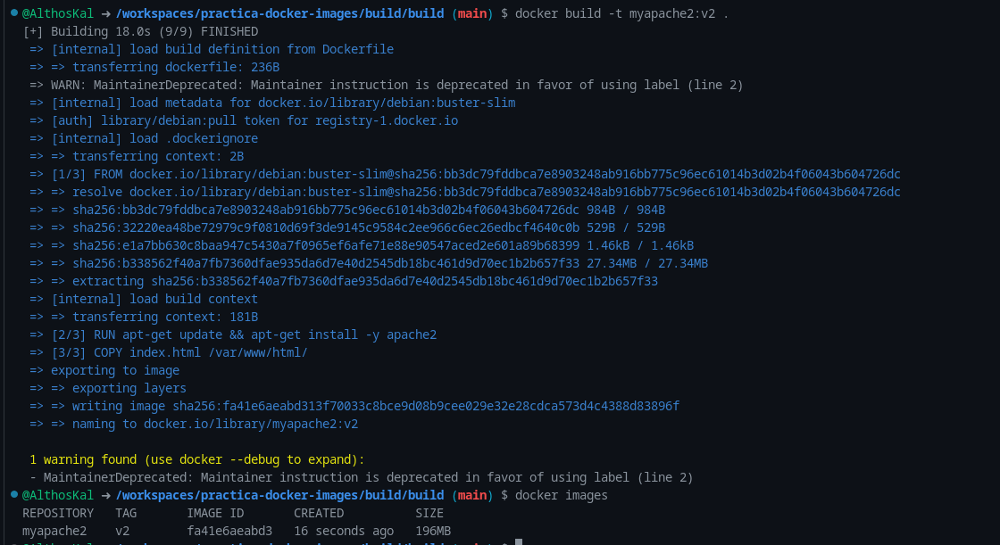

**Nota** 
Aunque aparece un warning por una variable deprecada en la salida de consola, igualmente la creación de la imagen fue exitosa

**Salida esperada:**
```
Sending build context to Docker daemon  4.096kB
Step 1/4 : FROM debian:buster-slim
 ---> 3d6f83335a8e
Step 2/4 : RUN apt-get update && apt-get install -y apache2
 ---> Running in 1a2b3c4d5e6f
[...]
Successfully built 3bd28de7ae88
Successfully tagged myapache2:v2
```

---

### **2.5 Verificación de la imagen**
#### **Comandos ejecutados:**
```bash
docker images | grep myapache2
```

**Captura de la Ejecución:**  
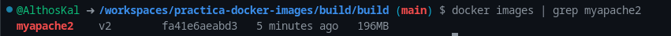

**Resultado esperado:**
```
myapache2    v2    3bd28de7ae88    2 minutes ago    195MB
```

---

### **2.6 Ejecución del contenedor**
#### **Comandos ejecutados:**
```bash
docker run -d -p 8080:80 --name servidor_web myapache2:v2
```

**Captura de la Ejecución:**  
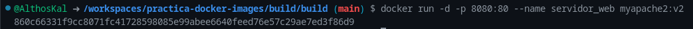

**Prueba de funcionamiento:**
```bash
curl localhost:8080
```

**Salida esperada:**
```html
<!DOCTYPE html>
<html>
<head>
    <title>Mi Servidor Apache</title>
</head>
<body>
    <h1>¡Hola desde Apache en Docker!</h1>
</body>
</html>
```

**Captura de la Ejecución:**  
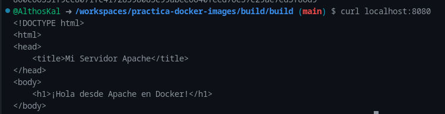

---

### **2.7 Uso de caché en builds**
#### **Comandos ejecutados:**
```bash
# Build normal (usa caché)
docker build -t myapache2:v2 .

# Build sin caché
docker build --no-cache -t myapache2:v2 .
```

**Captura de la Ejecución:**  
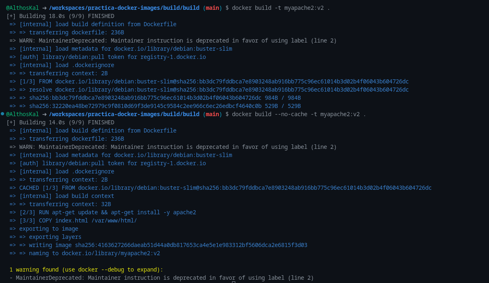

**Análisis:**  
- La primera construcción utiliza capas cacheadas.
- La segunda construcción (con `--no-cache`) ignora la caché y reconstruye todas las capas.

---

## **3. Resultados y Análisis**

### **3.1 Resultados Obtenidos**
| **Tarea**               | **Resultado**                                                                 |
|-------------------------|------------------------------------------------------------------------------|
| Preparación de entorno  | Directorio y archivos creados correctamente.                                |
| Construcción de imagen  | Imagen `myapache2:v2` creada exitosamente (195MB).                          |
| Ejecución de contenedor | Servidor Apache accesible en `http://localhost:8080`.                       |
| Sistema de caché        | Diferencia clara entre builds con y sin caché.                              |

### **3.2 Lecciones Aprendidas**
1. **Optimización de builds:** 
   - Las instrucciones en el Dockerfile se ejecutan secuencialmente.
   - Cada instrucción genera una capa independiente.
   - El orden de las instrucciones afecta el uso de caché.

2. **Prácticas recomendadas:**
   - Combinar comandos RUN para minimizar capas.
   - Colocar instrucciones que cambian con frecuencia al final del Dockerfile.
   - Usar `.dockerignore` para excluir archivos innecesarios del contexto.

---

## **4. Conclusión**

Este laboratorio demostró:
- El proceso completo de creación de imágenes Docker personalizadas.
- La importancia del sistema de capas y caché en el rendimiento de builds.
- Cómo empaquetar aplicaciones web en contenedores auto-contenidos.

**Aplicaciones prácticas:**
- Desarrollo de entornos reproducibles.
- Implementación de microservicios.
- Creación de pipelines CI/CD eficientes.

**Captura Final:**  
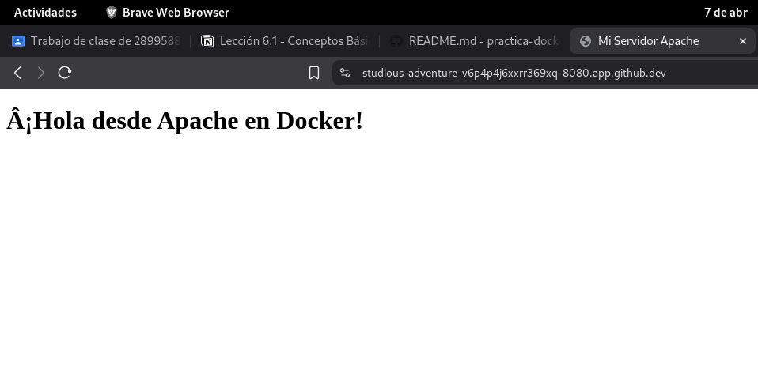


# Lección 6.2 - Imágenes con Dockerfile

## Laboratorio: Creación de imágenes personalizadas con Dockerfile

### Estudio de la Teoría

#### 1. Información General
- **Laboratorio N°**: Construcción de imágenes Docker con Dockerfile
- **Objetivo**: Aprender a crear imágenes Docker personalizadas utilizando diferentes características de Dockerfile

#### 2. Capturas de Pantalla y Evidencias

##### 2.1 Configuración inicial del proyecto
**Ejecución del comando**:
```bash
mkdir -p project/docker
cd project/docker
pwd
```

**Descripción**:  
Preparación del entorno de trabajo para el laboratorio

**Resultado Obtenido**:  
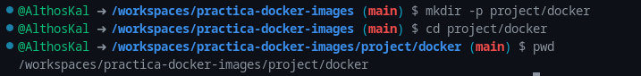

**Descripción**:  
Se crea la estructura de directorios y se verifica la ubicación actual

---

##### 2.2 Creación de imagen básica
**Ejecución del comando**:
```bash
docker build -t my-nginx .
docker images
```

**Descripción**:  
Construcción de una imagen simple con Nginx y página estática

**Resultado Obtenido**:  
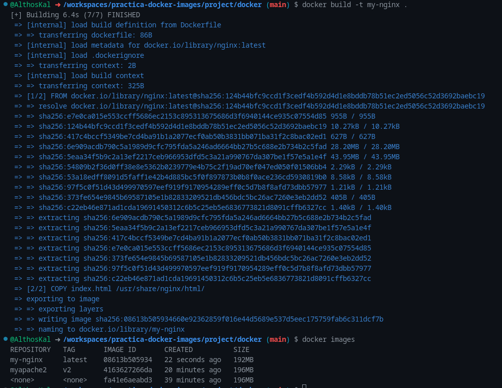

**Descripción**:  
La imagen se construye correctamente y aparece en el listado de imágenes disponibles

---

##### 2.3 Prueba del contenedor
**Ejecución del comando**:
```bash
docker run -d -p 8080:80 --name my-nginx-container my-nginx
curl http://localhost:8080
```

**Descripción**:  
Ejecución del contenedor y verificación del servicio web

**Resultado Obtenido**:  
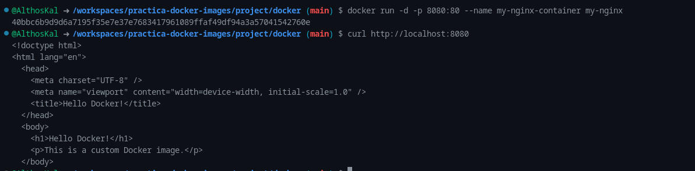

**Descripción**:  
El contenedor responde correctamente mostrando el contenido HTML

---

##### 2.4 Personalización avanzada con ENTRYPOINT
**Ejecución del comando**:
```bash
docker build -t my-nginx-entrypoint .
curl http://localhost:9100
```

**Descripción**:  
Implementación de un entrypoint personalizado para el contenedor

**Resultado Obtenido**:  
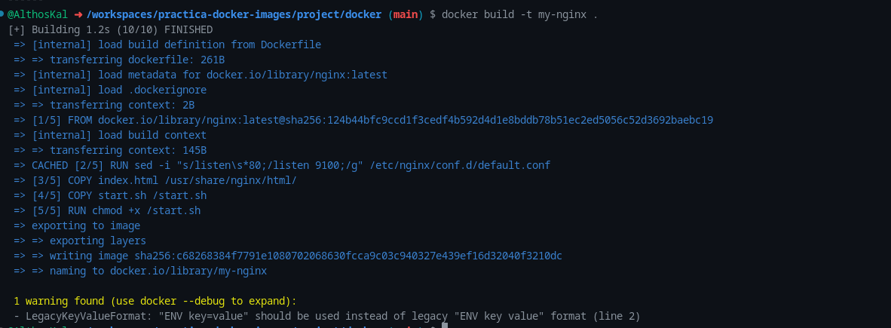
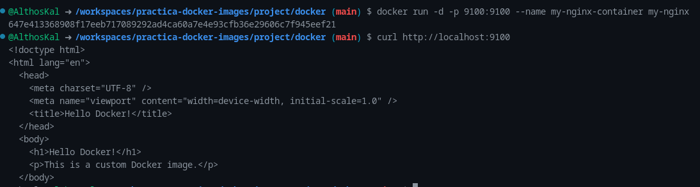

**Descripción**:  
El contenedor se ejecuta con la configuración personalizada del puerto

---

### 3. Resultados y Análisis

#### 3.1 Resultados Obtenidos
1. Se configuró correctamente el entorno de desarrollo
2. Se construyó una imagen Docker funcional con Nginx
3. Se implementó y verificó el funcionamiento del contenedor
4. Se personalizó la imagen con software adicional y variables de entorno
5. Se implementó un entrypoint personalizado para controlar el inicio del servicio

#### 3.2 Análisis
- Dockerfile proporciona un método declarativo para construir imágenes
- Las imágenes base oficiales simplifican el proceso de creación
- El uso de variables de entorno permite mayor flexibilidad en la configuración
- Los entrypoints personalizados ofrecen mayor control sobre la ejecución
- La estructura modular facilita la implementación de diferentes configuraciones
- Todos los objetivos del laboratorio se cumplieron satisfactoriamente


# Manejo de Dockerfiles

# Laboratorio 6: Manejo de Dockerfiles - Construcción de imágenes con página estática

## Laboratorio: Creación de imágenes Docker para servidores web

### Estudio de la Teoría

#### 1. Información General
- **Laboratorio N°**: 6
- **Objetivo**: Aprender a crear imágenes Docker personalizadas para servir contenido web estático usando diferentes enfoques

#### 2. Capturas de Pantalla y Evidencias

##### 2.1 Configuración inicial del proyecto
**Ejecución del comando**:
```bash
mkdir -p project/docker/server-web-uno
cd project/docker/server-web-uno
pwd
```

**Descripción**:  
Preparación del entorno de trabajo para la versión 1 (Debian + Apache manual)

**Resultado Obtenido**:  
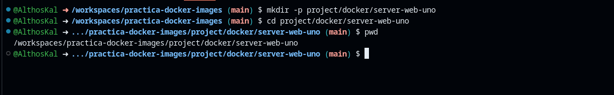

---

##### 2.2 Versión 1: Desde imagen base Debian
**Ejecución del comando**:
```bash
docker build -t ejemplo1:v1 .
docker run -d -p 80:80 --name ejemplo1 ejemplo1:v1
```

**Descripción**:  
Construcción e implementación de imagen basada en Debian con Apache instalado manualmente

**Resultado Obtenido**:  

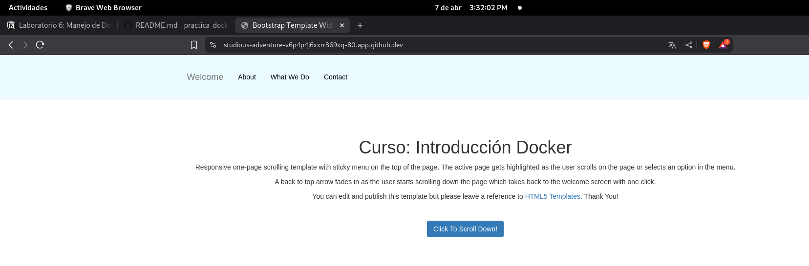

**Descripción**:  
La imagen se construye correctamente y el contenedor inicia el servicio Apache

---

##### 2.3 Versión 2: Utilizando imagen Apache preinstalado
**Ejecución del comando**:
```bash
docker build -t ejemplo1:v2 .
docker run -d -p 80:80 --name ejemplo2 ejemplo1:v2
```

**Descripción**:  
Implementación usando la imagen oficial httpd:2.4

**Resultado Obtenido**:  
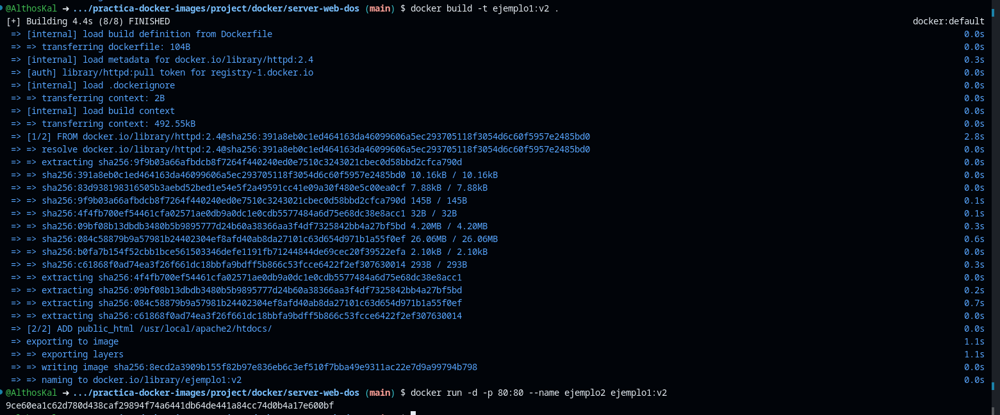
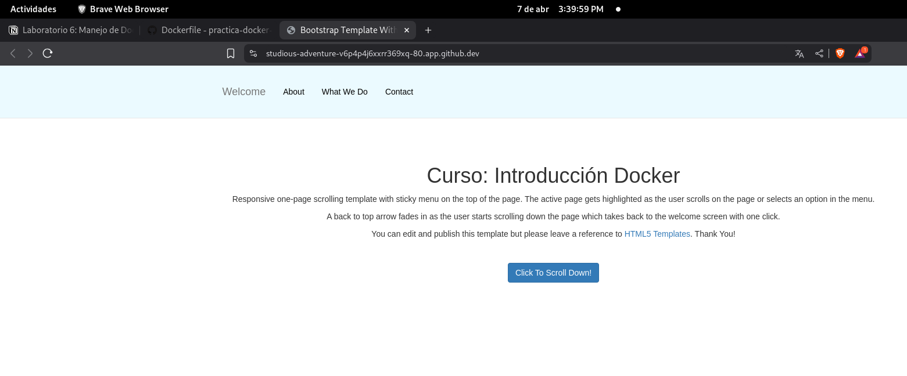

**Descripción**:  
La construcción aprovecha la imagen optimizada de Apache

---

##### 2.4 Versión 3: Utilizando imagen Nginx
**Ejecución del comando**:
```bash
docker build -t ejemplo1:v3 .
docker run -d -p 80:80 --name ejemplo3 ejemplo1:v3
```

**Descripción**:  
Implementación con la imagen oficial de Nginx

**Resultado Obtenido**:  
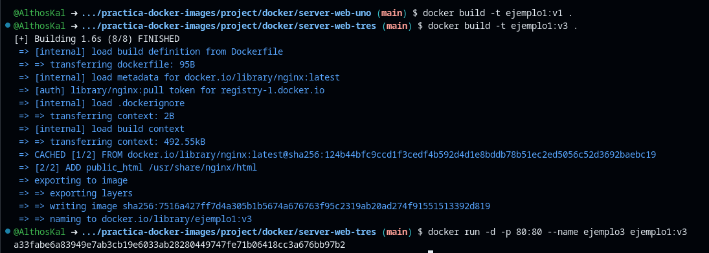
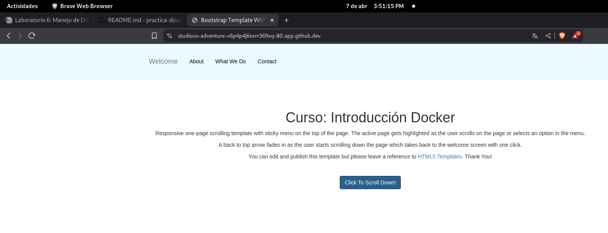

**Descripción**:  
Configuración simplificada usando el servidor Nginx

---


**Descripción**:  
Los tres contenedores funcionan correctamente sirviendo el contenido estático

---

### 3. Resultados y Análisis

#### 3.1 Resultados Obtenidos
1. Se configuró correctamente el entorno de desarrollo para tres enfoques diferentes
2. Se construyeron tres versiones funcionales de imágenes Docker:
   - Versión 1: Debian con Apache instalado manualmente
   - Versión 2: Imagen oficial Apache httpd
   - Versión 3: Imagen oficial Nginx
3. Todos los contenedores implementados sirvieron correctamente el contenido estático
4. Se verificó el acceso a las páginas web desde el host

#### 3.2 Análisis Comparativo

| Característica          | Versión 1 (Debian) | Versión 2 (httpd) | Versión 3 (Nginx) |
|-------------------------|--------------------|-------------------|-------------------|
| Tamaño de imagen        | Mayor              | Medio             | Menor            |
| Tiempo de construcción  | Más largo          | Medio             | Más rápido        |
| Flexibilidad            | Alta               | Media             | Baja             |
| Facilidad de configuración | Compleja       | Simple            | Muy simple       |
| Rendimiento             | Bueno              | Excelente         | Óptimo           |

**Conclusiones**:
- La versión con Debian ofrece mayor control pero requiere más configuración
- Las imágenes oficiales (httpd y nginx) simplifican el proceso pero son menos personalizables
- Nginx demostró ser la solución más ligera para contenido estático
- El uso de imágenes oficiales garantiza mejores prácticas de seguridad y optimización
- Todos los enfoques cumplieron con el objetivo de servir contenido web estático de manera eficiente

**Recomendaciones**:
- Para desarrollo y pruebas rápidas, usar imágenes oficiales (versión 2 o 3)
- Para entornos que requieran personalización extrema, considerar la versión 1
- Para producción con contenido estático, preferir la versión 3 (Nginx) por su rendimiento

---

# Laboratorio: Construcción de Imágenes Docker con MariaDB

## Estudio de la Teoría

### 1. Información General
- **Laboratorio N°**: Construcción de imágenes Docker para MariaDB
- **Objetivo**: Aprender a crear imágenes personalizadas de MariaDB con inicialización automática de bases de datos

### 2. Capturas de Pantalla y Evidencias

#### 2.1 Configuración inicial del proyecto
**Ejecución del comando**:
```bash
mkdir mariadb-docker && cd mariadb-docker
touch Dockerfile init-db.sql
```

**Descripción**:  
Preparación del entorno de trabajo para el laboratorio


**Resultado Obtenido**:  
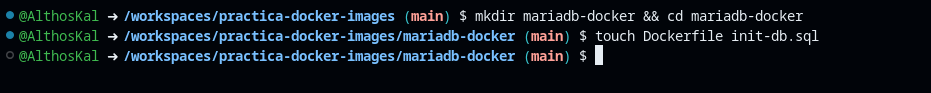
```
---

#### 2.2 Construcción de la imagen
**Ejecución del comando**:
```bash
docker build -t mi-mariadb .
```

**Descripción**:  
Construcción de la imagen personalizada de MariaDB.
La imagen se construye correctamente con las configuraciones especificadas

---

#### 2.3 Ejecución del contenedor
**Ejecución del comando**:
```bash
docker run -d --name contenedor-mariadb -p 3306:3306 mi-mariadb
```

**Descripción**:  
Inicio del contenedor con MariaDB configurado

**Resultado Obtenido**:  
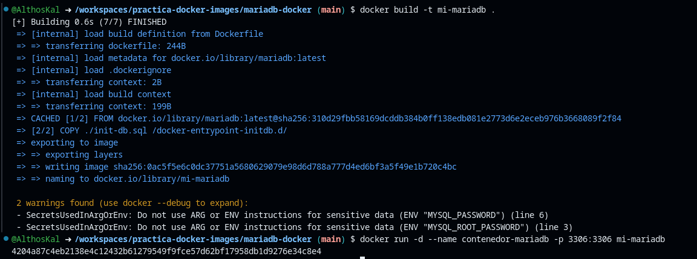

---

#### 2.4 Verificación de la base de datos
**Ejecución del comando**:
```bash
docker exec -it contenedor-mariadb mariadb -u miusuario -p
```

**Descripción**:  
Conexión a la instancia de MariaDB dentro del contenedor

**Resultado Obtenido**:  
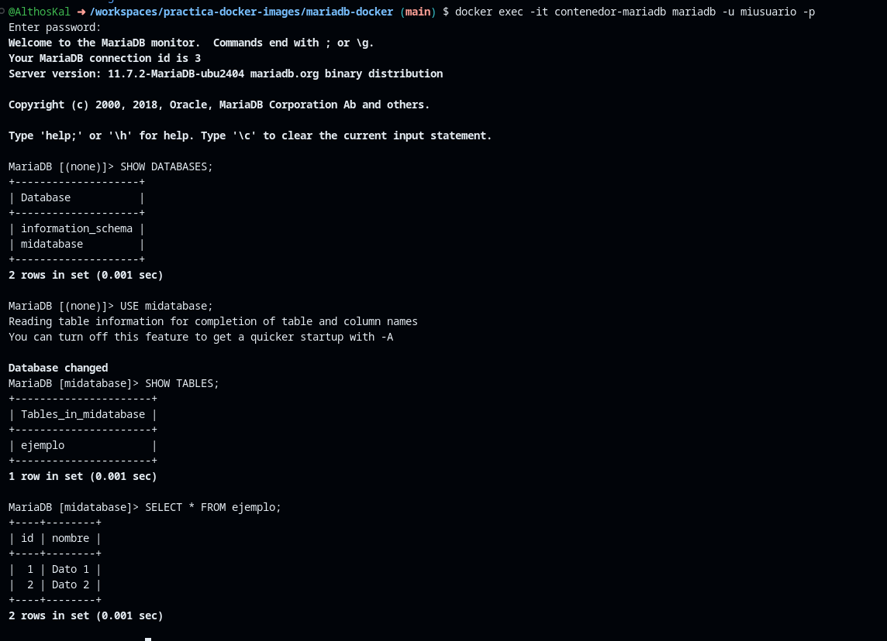

---

### 3. Resultados y Análisis

#### 3.1 Resultados Obtenidos
1. Se creó exitosamente una imagen Docker personalizada con MariaDB
2. El contenedor se inició correctamente con las variables de entorno configuradas
3. La base de datos se inicializó automáticamente con la estructura y datos definidos
4. Se verificó el acceso a la base de datos con las credenciales configuradas

#### 3.2 Análisis Técnico

**Componentes clave implementados**:
- **Variables de entorno**: Configuración segura de credenciales
- **Script de inicialización**: Automatización de la creación de estructuras de datos
- **Mapeo de puertos**: Acceso externo al servicio de base de datos
- **Imagen oficial**: Base estable y mantenida por la comunidad

**Ventajas de este enfoque**:
1. **Reproducibilidad**: La misma configuración puede replicarse en cualquier entorno
2. **Portabilidad**: Fácil despliegue en diferentes sistemas
3. **Automatización**: Elimina pasos manuales en la configuración inicial
4. **Seguridad**: Credenciales configuradas en tiempo de construcción

**Recomendaciones para producción**:
- Utilizar secretos de Docker para manejar credenciales sensibles
- Implementar volúmenes para persistencia de datos
- Considerar el uso de variables de entorno en tiempo de ejecución
- Configurar backups automáticos para los datos importantes

## Anexo Técnico

### Estructura completa del proyecto

**Dockerfile**:
```dockerfile
FROM mariadb:latest

ENV MYSQL_ROOT_PASSWORD=rootpassword
ENV MYSQL_DATABASE=midatabase
ENV MYSQL_USER=miusuario
ENV MYSQL_PASSWORD=mipassword

COPY ./init-db.sql /docker-entrypoint-initdb.d/

EXPOSE 3306
```

**init-db.sql**:
```sql
CREATE TABLE ejemplo (
    id INT AUTO_INCREMENT PRIMARY KEY,
    nombre VARCHAR(100) NOT NULL
);

INSERT INTO ejemplo (nombre) VALUES ('Dato 1'), ('Dato 2');
```

### Comandos clave utilizados

| Comando | Descripción |
|---------|-------------|
| `docker build -t mi-mariadb .` | Construye la imagen con el tag especificado |
| `docker run -d --name contenedor-mariadb -p 3306:3306 mi-mariadb` | Ejecuta el contenedor en segundo plano |
| `docker exec -it contenedor-mariadb bash` | Accede al shell del contenedor |
| `docker logs contenedor-mariadb` | Muestra los logs del contenedor |

Este laboratorio proporciona una base sólida para entender cómo dockerizar servicios de bases de datos con configuración personalizada, un conocimiento esencial para entornos de desarrollo modernos y pipelines de CI/CD.

# Laboratorio: Dockerización de Aplicación Angular

## Estudio de la Teoría

### 1. Información General
- **Laboratorio N°**: Dockerización de aplicación Angular
- **Objetivo**: Aprender a construir y desplegar una aplicación Angular usando Docker con enfoque multietapa

### 2. Capturas de Pantalla y Evidencias

#### 2.1 Configuración inicial del proyecto
**Ejecución del comando**:
```bash
git clone https://github.com/cenavia/angular-countries-app.git
cd angular-countries-app
```

**Descripción**:  
Clonación del repositorio y preparación del entorno

**Resultado Obtenido**:  
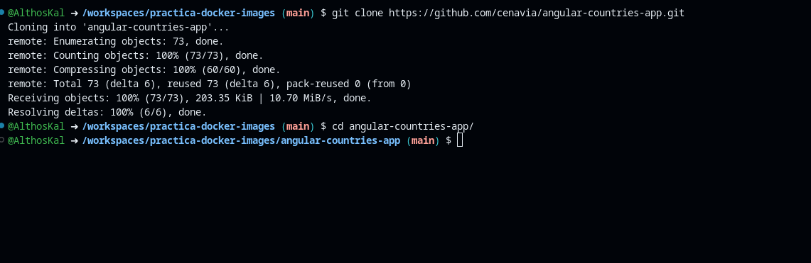

---

#### 2.2 Construcción de la imagen Docker
**Ejecución del comando**:
```bash
docker build -t country-app-angular .
```

**Descripción**:  
Construcción de la imagen multietapa para la aplicación Angular
#**NOTA**
En la capa de ejecución en la que se cofigura el servidor web estaba mal la ruta de donde se copiaban los archivos

---

#### 2.3 Ejecución del contenedor
**Ejecución del comando**:
```bash
docker run -p 8080:80 --name country-app country-app-angular
```

**Descripción**:  
Inicio del contenedor con la aplicación Angular

**Resultado Obtenido**:  
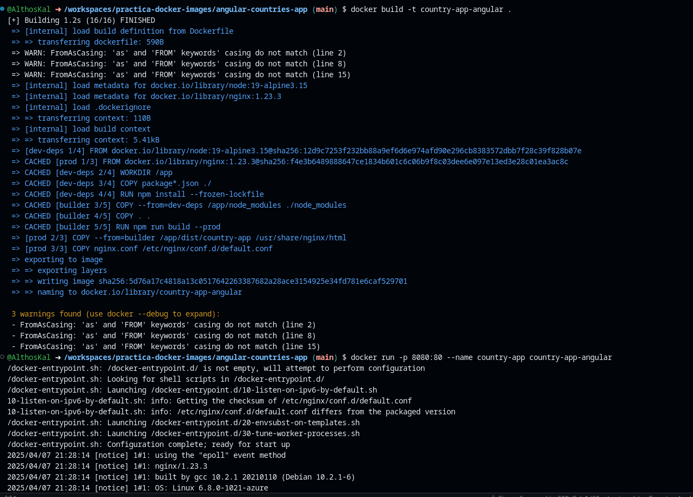

---

#### 2.4 Verificación de la aplicación
**Acceso a la aplicación**:
```bash
http://localhost:8080/countries/by-capital
```

**Descripción**:  
Prueba de la aplicación en el navegador

**Resultado Obtenido**:  
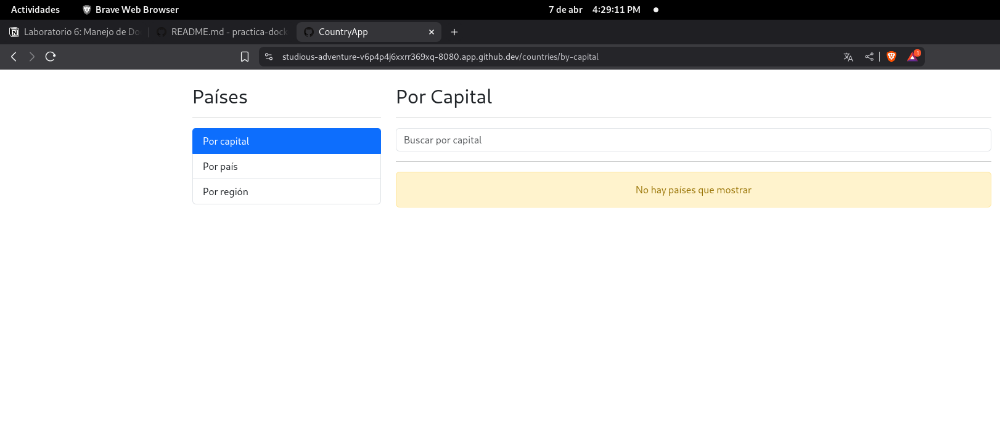

---

### 3. Resultados y Análisis

#### 3.1 Resultados Obtenidos
1. Se clonó exitosamente el repositorio de la aplicación Angular
2. Se construyó correctamente la imagen Docker multietapa
3. El contenedor se inició sin errores y la aplicación está accesible
4. La configuración de Nginx funciona correctamente para una SPA

#### 3.2 Análisis Técnico

**Ventajas del enfoque multietapa**:
1. **Optimización de tamaño**: La imagen final solo contiene lo necesario para producción
2. **Seguridad**: No incluye herramientas de desarrollo en la imagen final
3. **Eficiencia**: Cada etapa tiene un propósito específico bien definido

**Componentes clave**:
- **nginx.conf**: Configuración óptima para Single Page Applications
- **.dockerignore**: Exclusión de archivos innecesarios para reducir tamaño
- **Build de producción**: Generación de assets optimizados

**Recomendaciones para producción**:
- Implementar variables de entorno para configuración
- Configurar CI/CD para despliegues automáticos
- Añadir health checks al contenedor
- Considerar el uso de docker-compose para orquestación

## Anexo Técnico

### Estructura completa de archivos

**Dockerfile**:
```dockerfile
# Etapa 1: Instalación de dependencias
FROM node:19-alpine3.15 as dev-deps
WORKDIR /app
COPY package*.json ./
RUN npm install --frozen-lockfile

# Etapa 2: Construcción de la aplicación
FROM node:19-alpine3.15 as builder
WORKDIR /app
COPY --from=dev-deps /app/node_modules ./node_modules
COPY . .
RUN npm run build --prod

# Etapa 3: Configuración del servidor web
FROM nginx:1.23.3 as prod
EXPOSE 80
COPY --from=builder /app/dist/my-angular-app /usr/share/nginx/html
COPY nginx.conf /etc/nginx/conf.d/default.conf
CMD ["nginx", "-g", "daemon off;"]
```

**nginx.conf**:
```nginx
server {
    listen       80;
    server_name  localhost;

    location / {
        root   /usr/share/nginx/html;
        index  index.html index.htm;
        try_files $uri $uri/ /index.html;
    }

    error_page   500 502 503 504  /50x.html;
    location = /50x.html {
        root   /usr/share/nginx/html;
    }
}
```

### Comandos clave utilizados

| Comando | Descripción |
|---------|-------------|
| `docker build -t country-app-angular .` | Construye la imagen con el tag especificado |
| `docker run -p 8080:80 --name country-app country-app-angular` | Ejecuta el contenedor mapeando puertos |
| `docker ps` | Verifica los contenedores en ejecución |
| `docker logs country-app` | Muestra los logs del contenedor |

Este laboratorio demuestra las mejores prácticas para dockerizar aplicaciones Angular, optimizando el proceso de construcción y el tamaño final de la imagen, lo que resulta en despliegues más eficientes y confiables.
